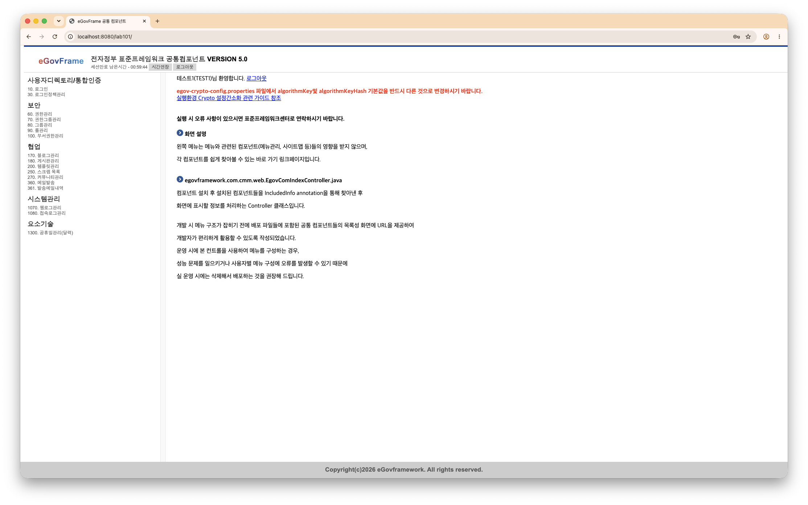

# lab101

## LAB 1-1. 공통컴포넌트 생성 및 조립도구 실습

### STEP 1-1-01 - Project 생성
- **Eclipse Menu > Window > Perspective > Open Perspective > Other… > eGovFrame >Open > eGovFrame Perspective 실행**
- Eclipse Menu > eGovFrame > Start > New Web Project 선택
- 프로젝트 정보(Generate Example 미선택)

| 항목 | 내용 |
| --- | --- |
| Project name | lab101 |
| Target Runtime | <None> |
| Dynamic Web Module Version | 5.0 |
| Group Id | egovframe |
| Artifact Id | lab101 |
| Version | 1.0.0 |

---

### STEP 1-1-02 - Database Connection 생성
- 실행 : `../bin/mysql-8.0.36/startup.sh` 
- 종료 : `../bin/mysql-8.0.36/stop.sh`
- **Data Source Explore**에서 DB에 접근 

| 항목 | 내용 |
| --- | --- |
| Database | com |
| username | com |
| password | ** | 
| port | ** |

---

### STEP 1-1-03 - 공통컴포넌트 생성 위자드 실행
1. 프로젝트 선택 마우스 우클릭> New > eGovFrame Common Component 선택
2. 공통 컴포넌트 목록 중 “역할/권한관리” 및 “게시판”을 선택하고 [Next]를 클릭
3. 선택한 컴포넌트를 확인하고 테이블 설치여부를 선택 (“사용자 DB에 생성” 선택)
    - Select DB: com
4. Connection Test > Create Table > Finish
5. 생성된 소스 확인

---

### STEP 1-1-04 - lab101 실행
1. Project > Clean
2. 프로젝트 우클릭 > Maven > Update Project > Force Update of ...
3. 프로젝트 우클릭 > Run As > 1 Run On Server > Next > Finish

---

### STEP 1-1-05 - lab101 실행화면

