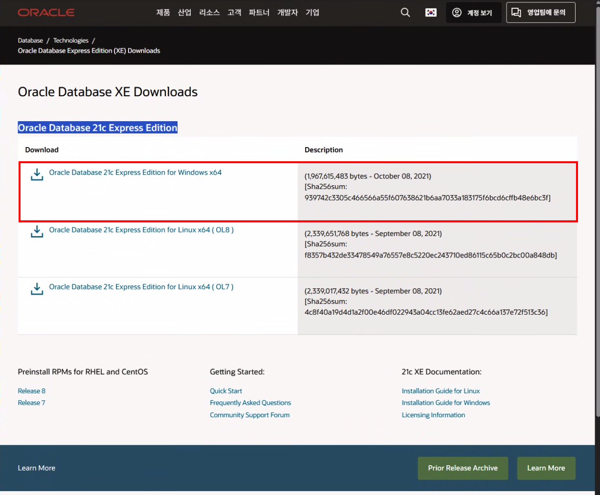
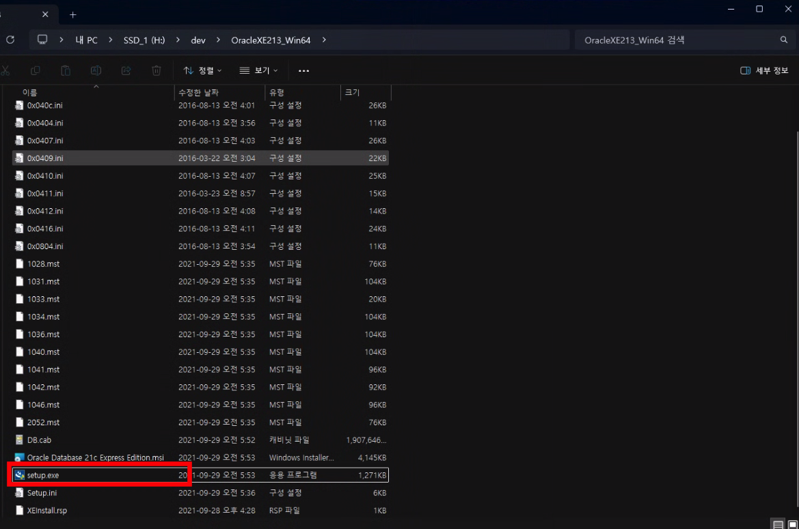
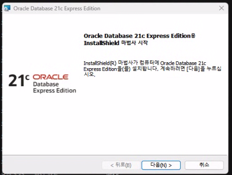
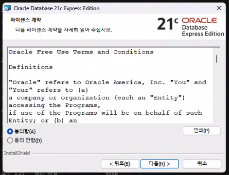
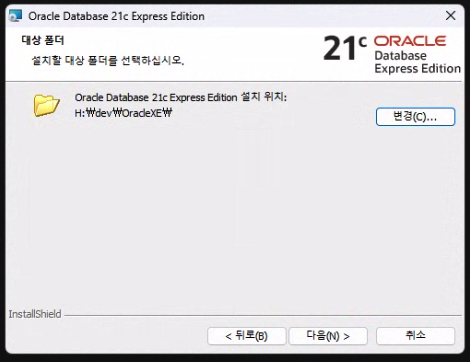
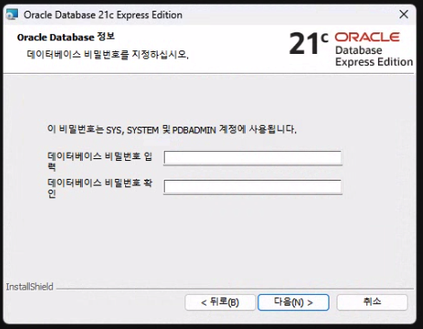
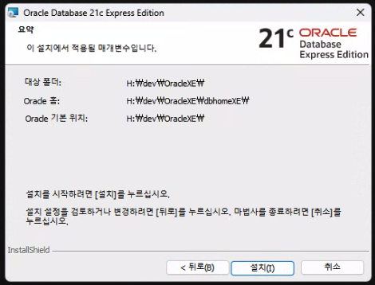
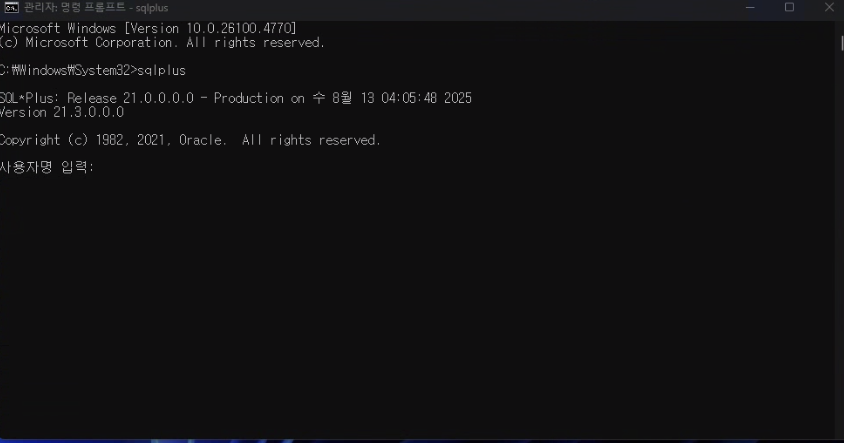

# Oracle Database 21c Express Edition  설치  
  
```
시스템 환경
- 접속 OS : Windows 11 Pro(25H2, 26200.7922)

```
  
-----  
  
- 특이점 :   
* 리소스 제한 : Oracle Database XE는 최대 사용자 데이터 크기(예: 21c XE의 경우 12GB) 및 활용할 수 있는 RAM 에 대한 제한(예: 21c XE의 경우 2GB)과 같은 특정 리소스 제한이 있음.  
  
1. 파일 다운로드 (Oracle Database 21c Express Edition for Windows x64) 이후 압축해제 : [https://www.oracle.com/kr/database/technologies/xe-downloads.html](https://www.oracle.com/kr/database/technologies/xe-downloads.html)  
  
  
  
2. 압축 해제된 OracleXE213_Win64 폴더에서 setup.exe 파일 실행  
  
  
  
3. [다음] >> 동의함 >> [다음]  
  
  
  
4. [변경]으로 설치 경로를 변경하거나[다음] 으로 기본 설치 경로로 지정  
- 다른 드라이브에 설치 시 해당 드라이브에 폴더 생성(예 : OracleXE)하고 다음과 같이 설치 경로 지정(예 : H:\dev\OracleXE)  
  
  
5. SYS, SYSTEM 및 PDBADMIN 계정 비밀번호 지정 : 12345 >> [다음] >> [설치] >> 허용 >> [완료]  
  
  
  
6. 명령프롬포트(CMD) 실행 후 sqlplus 입력   
  
  
7. 환경변수 추가 : 설정 > 시스템 > 정보 > 고급 시스템 설정 > 고급 탭 > 환경 변수(N)...  클릭  
- 시스템 변수  
    - 변수 이름 : ORACLE_HOME  
    - 변수 값 : C:\app\사용자명\product\21c\dbhomeXE 또는 위에서 설정한 Oracle 설치 경로\product\21c\dbhomeXE  
- PATH 추가  
    - 변수 값 : %ORACLE_HOME%\bin  
  
  
